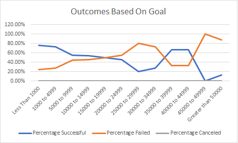

# Kickstarting with Excel
## Overview of Project
### Purpose
The purpose of this project is to gain insight on the outcomes of different campaigns based on their launch dates and their funding goals. I've created graphs and charts to show the different campaign outcomes using the data provided. 
## Analysis and Challenges
### Analysis of Outcomes Based on Launch Date
Projects started in May had the highest number of successes compared to all other months as well as the highest rate of success. June was second as far as number of successes and success rate. December had the lowest number of successes with only two more successful campaigns than failed ones, with November and January coming in second and third respectively as far as fewest successes.

### Analysis of Outcomes Based on Goals
Campaigns with goals less than $1000 had the highest success rate. Campaigns with a goal between $1000 and $4999 had the second highest success rate by 3 percent, as well as having the greatest number of total successes. Meanwhile campaigns with goals between $45000 and $49999, and greater than $50000 had the lowest success rates by far.

### Challenges and Difficulties Encountered
Something I found challenging was figuring out the COUNTIFS function in Excel. There was a lot of information to fit into one function so it took me a few times to get the formatting correct. Also when I copied and pasted the the function into the cell in the next column it changed some of the variables and I didn't notice at first so I had to make sure they were all correct.
## Results
One thing I can conclude from the outcomes based on launch date is that May is the best month to launch a campaign because it had the highest number of successes as well as the highest success rate. It was also evident that December is the worst month to launch a campaign, having the lowest number of successes as well as the lowest success rate.
When it comes to outcomes based on goals it is obvious that the goal should be kept under $5000.
One limitation to this dataset is that we do not know the number of people working on each campaign. Something else that would have been nice to know was the number of hours per day or week that were put into the campaign.
Another graph that could have been useful would have been a graph that showed the relationship between outcomes based on launch date using years instead of month to see if some years had more successful campaigns than others. A table showing percentage funded compared to average donation might also have been useful.
